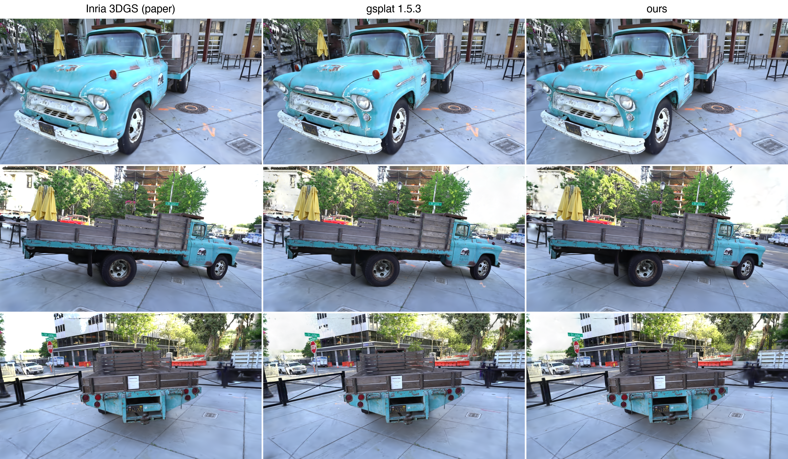

# 3D Gaussian Splatting

A minimal implementation of [3D Gaussian Splatting for Real-Time Radiance Field Rendering](https://repo-sam.inria.fr/fungraph/3d-gaussian-splatting/) built from the ground up with custom CUDA kernels.



## Overview

This project implements the core 3DGS rasterization algorithm entirely from scratch, including:
- Custom CUDA kernels for tile-based gaussian projection and rendering
- Differentiable rasterizer with PyTorch bindings
- Training pipeline with COLMAP dataset integration

## Performance

Measured on the Tanks and Temples Truck scene (979x546), trained for 5,000 iterations on one NVIDIA L4 GPU.

| | mine | Inria 3DGS | `gsplat` 1.5.3 |
|---|---|---|---|
| Iterations | 5,000 | 5,000 | 5,000 |
| Gaussians | 1,176,416 | 1,481,689 | 3,414,025 |
| Train wall time | 130 s | 296 s | 680 s |
| Test PSNR | 23.48 dB | 23.51 dB | 23.41 dB |
| Render, median of 500 | 4.62 ms | 11.66 ms | 20.25 ms |
| Render ms per million gaussians | **3.93** | 7.87 | 5.93 |

This implementation considerably beats the original implementation on performance, and does beat `gsplat`. If I run my learned model through `gsplat`'s pipeline and `gsplat`'s model through mine:

| Model | Gaussians | mine | `gsplat` | mine faster by |
|---|---|---|---|---|
| mine | 1,176,416 | 4.45 ms | 7.36 ms | **1.65x** |
| `gsplat` | 3,414,025 | 12.07 ms | 20.20 ms | **1.67x** |

Note: this comparison was run with all of the fancy `gsplat` features (antialiasing, alternative densification strategies, etc.) turned off. It's technically doing the same render, but this also isn't fully a fair comparison. This is a particular scenario on a GPU that I profiled specifically. `gsplat` is a more flexible library that supports different camera models, distributed training, more complex rendering options, etc. While mine is faster in this particular instance, it does not support any of the generalizations.

## Usage

```bash
poetry install
poetry run python -m gaussian_splatting.main path/to/colmap/scene
```

**Dataset Structure:**
```
scene/
├── sparse/0/  # COLMAP reconstruction
└── images/    # Training images
```

You can download pre-processed COLMAP datasets from [here](https://demuc.de/colmap/datasets/).
